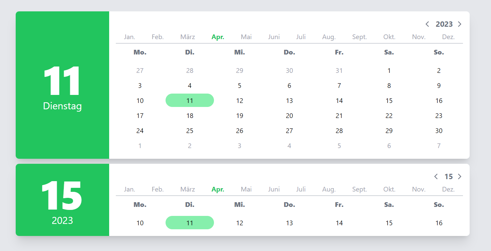

# Vue 3 Calendar Composable

This composable is a calendar utility for Vue 3 projects, providing a flexible and easy-to-use solution to build
calendars.
It supports languages provided by dayjs automatically and detects it automatically (can be turned off).
Can either start on Monday (default) or Sunday.
Can either show working days or the whole week



## Installation

```bash
npm i vue3-calendar-composable
yarn add vue3-calendar-composable
pnpm add vue3-calendar-composable
```

## Usage

Import the useCalendar composable in your component and provide the optional CalendarConfig object.

```js
import {useCalendar} from "vue3-calendar-composable";

const {dates, months, current, set, format} = useCalendar();
```

### CalendarConfig

The CalendarConfig object allows customization of the calendar's behavior:

- date: Date | Dayjs (Optional) - The initial date to display.
- week: MaybeRef<number> (Optional) - Reference to a week number.
- month: MaybeRef<number> (Optional) - Reference to a month number.
- year: MaybeRef<number> (Optional) - Reference to a year number.
- type: "week" | "month" (Optional, default: "month") - The display mode of the calendar.
- adaptUserLanguage: boolean (Optional, default: true) - Whether to adapt to the user's language or use English as
  default.
- startOnSunday: boolean (Optional, default: false) - Whether the week should start on Sunday.
- onlyShowWeek: boolean (Optional, default: false) - Whether to display only five days of the week.

```ts
interface CalendarConfig {
  date?: Date | Dayjs
  week?: MaybeRef<number>
  month?: MaybeRef<number>
  year?: MaybeRef<number>
  type?: MaybeRef<"week" | "month">
  adaptUserLanguage?: MaybeRef<boolean>
  startOnSunday?: MaybeRef<boolean>
  onlyShowWeek?: MaybeRef<boolean>
}
```

### Methods

The useCalendar composable exposes several methods for interacting with the calendar data:

- dates: A computed property that returns an array of "CalendarDate" Objects based on the current configuration. A day
  with each date of the current config, isToday to check if a date is actually today (for styling / selection), a key to
  set in v-for loop and isCurrent to check whether the dates are in the current month/week (for styling / disabling
  selection).
- months: A computed property that returns an array of all months.
- current: An object containing the current dayjs instances where today is the actual day and the exposed dayjs key is
  the current Reference we have provided based off the configuration. On current.dayjs you will have access to
  (vanilla) dayjs provided options like "format".
- set: A function to increment, decrement, or set the week, month, or year. "add" & "decrement" would add or decrement
  by one. If "to" is a number it does as told with positive and negative numbers (can go to the previous year or next
  and so on...). Returns void => only edits the used computed properties (dates & current.dayjs)
- format: A function to format a dayjs instance based on the provided format - pass the Dayjs instance and use week to
  get the isoWeek Number or use formatting options based on https://day.js.org/docs/en/display/format.

```
dates: ComputedRef<CalendarDates[]>
months: ComputedRef<Dayjs[]> 
current: {today: dayjs.Dayjs, dayjs: ComputedRef<Dayjs>}
set: (type: ("week" | "month" | "year"), to: (number | "add" | "decrement")) => void 
format: (dayjs: Dayjs, format: ("week" | string)) => (number | string)
```

```ts
// dates object => see usage in example
export interface CalendarDate {
  date: Dayjs
  isToday: boolean
  key: string
  isCurrent: boolean
}
```

### 💡 package type export

we also export the following internal types to type your props and functions: CalendarDate, Current
and the dayjs library type: Dayjs

### Examples

```vue

<script lang="ts" setup>
import {useCalendar, type Dayjs} from "vue3-calendar-composable";
import {ref} from "vue"

const {dates, current} = useCalendar();
const selectedDate = ref<Dayjs>(current.dayjs.value);

const dateIsSelected = (date: Dayjs): boolean => {
  return date.format("DD-MM-YYYY") === selectedDate.value.format("DD-MM-YYYY");
};
</script>
```

```vue

<template>
  <section class="grid">
    <button
        v-for="{ date, isCurrent, key, isToday } in dates"
        :key="key"
        :disabled="!isCurrent"
        :class="{
        '!bg-indigo-400': isToday,
        '!bg-blue-800': dateIsSelected(date),
      }"
        @click="selectedDate = date"
    >
      <span v-text="date.format('D')"/>
    </button>
  </section>
</template>
```
